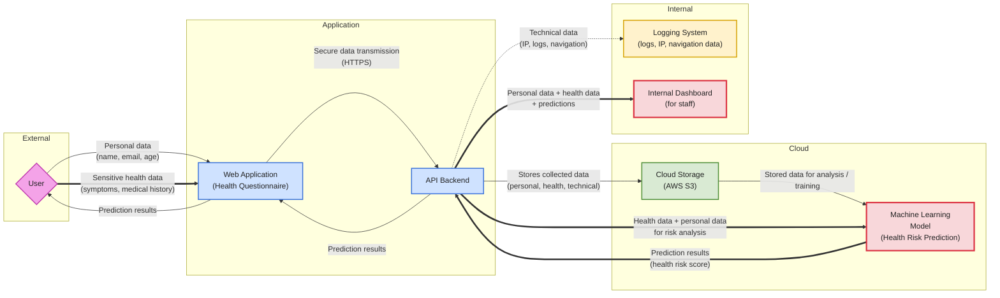

# HealthPredict-AI

```mermaid
flowchart LR
    subgraph EXT["External"]
        U{User}
    end

    subgraph APP["Application"]
        WA["Web Application<br/>(Health Questionnaire)"]
        API["API Backend"]
    end

    subgraph CLOUD["Cloud"]
        S3["Cloud Storage<br/>(AWS S3)"]
        ML["Machine Learning<br/>Model<br/>(Health Risk Prediction)"]
    end

    subgraph INT["Internal"]
        LOG["Logging System<br/>(logs, IP, navigation data)"]
        DASH["Internal Dashboard<br/>(for staff)"]
    end

    U -->|"Personal data<br/>(name, email, age)"| WA
    U ==>|"Sensitive health data<br/>(symptoms, medical history)"| WA

    WA -->|"Secure data transmission<br/>(HTTPS)"| API

    API -->|"Stores collected data<br/>(personal, health, technical)"| S3
    S3 -->|"Stored data for analysis / training"| ML

    API ==>|"Health data + personal data<br/>for risk analysis"| ML
    ML ==>|"Prediction results<br/>(health risk score)"| API

    API -->|"Prediction results"| WA
    WA -->|"Prediction results"| U

    API -.->|"Technical data<br/>(IP, logs, navigation)"| LOG

    API ==>|"Personal data + health data<br/>+ predictions"| DASH

    classDef app fill:#cfe2ff,stroke:#3b73d9,stroke-width:2px,color:#222;
    classDef external fill:#f4a3e8,stroke:#c13bb0,stroke-width:2px,color:#222;
    classDef cloud fill:#d9ead3,stroke:#4f8f3a,stroke-width:2px,color:#222;
    classDef internal fill:#fff2cc,stroke:#d6a100,stroke-width:2px,color:#222;
    classDef sensitive fill:#f8d7da,stroke:#dc3545,stroke-width:3px,color:#222;

    class WA,API app;
    class U external;
    class S3,ML cloud;
    class LOG,DASH internal;
    class ML,DASH sensitive;
```