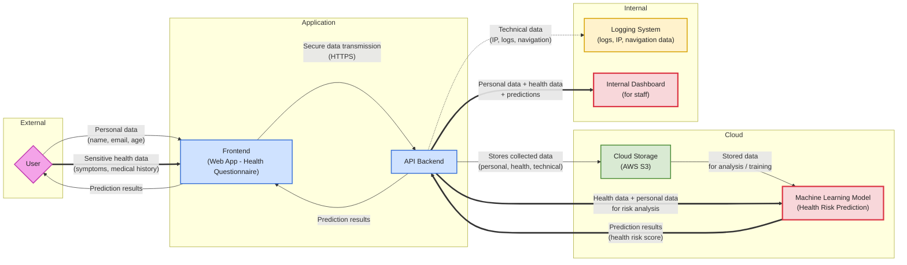

# HealthPredict-AI

# Liste des données classifiées – HealthPredict AI

## Description

L’application HealthPredict AI collecte et traite plusieurs types de données afin de prédire des risques de maladies via un modèle d’intelligence artificielle.

Ces données sont classées selon leur nature et leur niveau de sensibilité conformément aux principes du RGPD.

---

## Classification des données

| Donnée | Exemple | Type de donnée | Catégorie RGPD | Niveau de sensibilité | Finalité |
|-------|--------|---------------|----------------|----------------------|---------|
| Nom | Dupont | Identité | Donnée personnelle | Moyenne | Identifier l’utilisateur |
| Email | user@email.com | Contact | Donnée personnelle | Moyenne | Authentification / communication |
| Âge | 35 ans | Profil | Donnée personnelle | Moyenne | Analyse du risque |
| Symptômes | toux, fatigue | Santé | Donnée sensible | Très élevée | Analyse médicale par IA |
| Historique médical | maladies passées | Santé | Donnée sensible | Très élevée | Amélioration de la précision du modèle |
| Adresse IP | 192.168.x.x | Technique | Donnée personnelle | Moyenne | Sécurité / traçabilité |
| Logs | connexions, erreurs | Technique | Donnée technique | Faible à moyenne | Monitoring / audit |
| Navigation | pages visitées | Comportementale | Donnée personnelle | Moyenne | Amélioration UX |
| Prédiction IA | score de risque | Donnée dérivée | Donnée sensible | Très élevée | Résultat fourni à l’utilisateur |

---

## Données critiques

Les données suivantes sont considérées comme **hautement sensibles** :

- Données de santé :
  - symptômes
  - historique médical
- Données dérivées :
  - prédictions du modèle IA

Ces données nécessitent :
- un **consentement explicite**
- un **niveau de sécurité renforcé**
- une **gestion stricte des accès**

---

## Remarque

Les données de santé sont classées comme **données sensibles** selon le RGPD (article 9), ce qui implique des obligations légales strictes pour leur traitement et leur stockage.

# Identification des acteurs du traitement – HealthPredict AI

## Description

Le traitement des données dans HealthPredict AI implique plusieurs acteurs ayant des rôles et responsabilités distincts, conformément au RGPD.

---

## Acteurs du traitement

| Acteur | Type | Rôle | Responsabilités |
|-------|------|------|----------------|
| Utilisateur | Personne concernée | Fournit ses données | Remplit le questionnaire, reçoit les résultats |
| HealthPredict AI | Responsable de traitement | Définit les finalités et moyens du traitement | Collecte, analyse et utilisation des données |
| AWS (Amazon Web Services) | Sous-traitant | Hébergement des données | Stockage des données (S3), sécurité infrastructure |
| Service de logs | Sous-traitant (potentiel) | Gestion des logs techniques | Stockage et traitement des données techniques |
| Équipes internes | Personnel autorisé | Accès aux données via dashboard | Analyse, suivi, support utilisateur |
| Modèle de Machine Learning | Outil de traitement | Analyse des données | Génère des prédictions de risque |

---

## Points de vigilance

- Accès interne aux données sensibles (santé)
- Hébergement via un fournisseur cloud potentiellement hors UE
- Multiplication des acteurs impliqués dans le traitement

---

## Remarque

Le responsable de traitement (HealthPredict AI) doit :

- Encadrer contractuellement les sous-traitants
- Garantir la sécurité des données
- Assurer la conformité RGPD
- Limiter les accès aux seules personnes autorisées