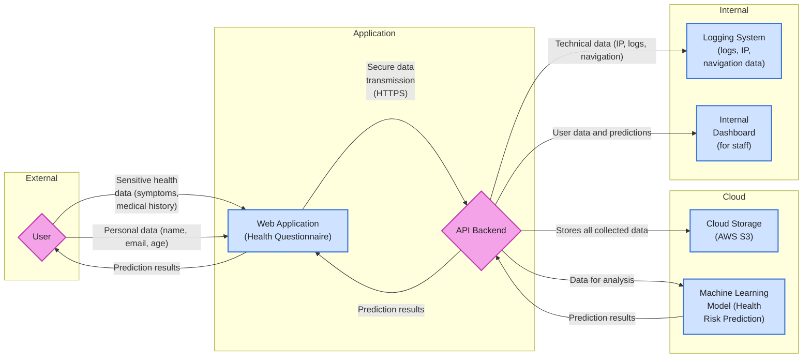

# HealthPredict-AI

```mermaid
flowchart LR
    subgraph EXT["External"]
        U{User}
    end

    subgraph APP["Application"]
        WA["Web Application<br/>(Health Questionnaire)"]
        API{"API Backend"}
    end

    subgraph CLOUD["Cloud"]
        S3["Cloud Storage<br/>(AWS S3)"]
        ML["Machine Learning<br/>Model (Health<br/>Risk Prediction)"]
    end

    subgraph INT["Internal"]
        LOG["Logging System<br/>(logs, IP,<br/>navigation data)"]
        DASH["Internal<br/>Dashboard<br/>(for staff)"]
    end

    U -->|"Sensitive health<br/>data (symptoms,<br/>medical history)"| WA
    U -->|"Personal data (name, email, age)"| WA
    WA -->|"Secure data<br/>transmission<br/>(HTTPS)"| API
    API -->|"Prediction results"| WA
    WA -->|"Prediction results"| U

    API -->|"Data for analysis"| ML
    ML -->|"Prediction results"| API
    API -->|"Stores all collected data"| S3

    API -->|"Technical data (IP, logs, navigation)"| LOG
    API -->|"User data and predictions"| DASH

    classDef process fill:#cfe2ff,stroke:#3b73d9,stroke-width:2px,color:#222;
    classDef actor fill:#f4a3e8,stroke:#c13bb0,stroke-width:2px,color:#222;

    class WA,S3,ML,LOG,DASH process;
    class U,API actor;
```